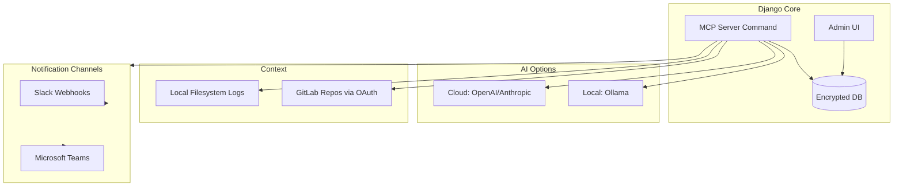

# GitLab MCP Bridge

A Django-based Model Context Protocol (MCP) server that integrates GitLab repositories with AI-powered log analysis and automated fix suggestions. This system supports multiple clients, cloud and local LLMs, and notification channels.

## Features

- **GitLab OAuth Integration**: Secure OAuth2 authentication for GitLab repositories
- **Multi-Client Support**: Manage multiple GitLab connections and repositories
- **AI-Powered Analysis**: Support for OpenAI, Anthropic, and local Ollama models
- **Log Analysis**: Automatic error detection and context extraction from log files
- **Fix Suggestions**: AI-generated code fixes based on errors and repository context
- **Notifications**: Slack and Microsoft Teams integration (future-ready)
- **Django Admin UI**: Easy configuration management through Django Admin

## Architecture



## Prerequisites

- Python 3.10 or higher
- Django 5.0 or higher
- GitLab account with OAuth application
- (Optional) OpenAI/Anthropic API keys or local Ollama installation

## Installation

1. **Clone the repository**:
   ```bash
   git clone <repository-url>
   cd gitlab-mcp-bridge
   ```

2. **Create and activate virtual environment**:
   ```bash
   python3 -m venv venv
   source venv/bin/activate  # On Windows: venv\Scripts\activate
   ```

3. **Install dependencies**:
   ```bash
   pip install -r requirements.txt
   ```

4. **Run migrations**:
   ```bash
   python manage.py migrate
   ```

5. **Create superuser**:
   ```bash
   python manage.py createsuperuser
   ```

6. **Run Django development server**:
   ```bash
   python manage.py runserver
   ```

7. **Access Django Admin**:
   Navigate to `http://localhost:8000/admin/` and log in with your superuser credentials.

## Configuration

### 1. Configure GitLab Connection (First Step)

1. In Django Admin, go to **MCP Bridge > GitLab Connections**
2. Click **Add GitLab Connection**
3. Fill in:
   - **Name**: A friendly name (e.g., "My GitLab")
   - **Instance URL**: Your GitLab URL (e.g., `https://gitlab.com`)
   - **Client ID**: Leave blank for now
   - **Client Secret**: Leave blank for now
4. Click **Save**
5. **Important**: Note the connection ID from the URL (e.g., if URL is `/admin/mcp_bridge/gitlabconnection/1/change/`, the ID is `1`)

### 2. Set Up GitLab OAuth Application

1. Go to your GitLab instance (e.g., `https://gitlab.com/-/profile/applications`)
2. Create a new OAuth application:
   - **Name**: GitLab MCP Bridge
   - **Redirect URI**: `http://localhost:8000/mcp/gitlab/oauth/callback/<YOUR_CONNECTION_ID>/`
     - Replace `<YOUR_CONNECTION_ID>` with the actual ID from step 1 (e.g., `http://localhost:8000/mcp/gitlab/oauth/callback/1/`)
   - **Scopes**: `api`, `read_user`
3. Click **Save** and copy the **Application ID** and **Secret**

### 3. Complete GitLab Connection Setup

1. Go back to Django Admin and edit the GitLab Connection you created
2. Fill in:
   - **Client ID**: Paste the Application ID from step 2
   - **Client Secret**: Paste the Secret from step 2
3. Click **Save**
4. Click **Connect to GitLab** button to authorize
5. Repositories will be automatically synced

### 3. Configure AI Models

#### For OpenAI:
1. Go to **MCP Bridge > LLM Providers**
2. Add provider:
   - **Name**: OpenAI
   - **Provider Type**: OpenAI
   - **Base URL**: `https://api.openai.com/v1`
   - **API Key**: Your OpenAI API key
3. Go to **MCP Bridge > AI Models**
4. Add model:
   - **Provider**: OpenAI
   - **Model ID**: `gpt-4o` (or your preferred model)
   - **Display Name**: GPT-4o
   - **Is Default**: Check if you want this as default

#### For Anthropic:
1. Add provider:
   - **Name**: Anthropic
   - **Provider Type**: Anthropic
   - **Base URL**: `https://api.anthropic.com`
   - **API Key**: Your Anthropic API key
2. Add model:
   - **Model ID**: `claude-3-5-sonnet-20241022`
   - **Display Name**: Claude 3.5 Sonnet

#### For Google Gemini:
1. Get your API key from: https://makersuite.google.com/app/apikey
2. Add provider:
   - **Name**: Google Gemini
   - **Provider Type**: Google Gemini
   - **Base URL**: `https://generativelanguage.googleapis.com` (or leave default)
   - **API Key**: Your Gemini API key
3. Add model:
   - **Model ID**: `gemini-pro` or `gemini-1.5-pro` or `gemini-1.5-flash`
   - **Display Name**: Gemini Pro

#### For Ollama (Local):
1. Install Ollama: https://ollama.ai
2. Pull a model: `ollama pull qwen2.5-coder:7b`
3. Add provider:
   - **Name**: Ollama Local
   - **Provider Type**: Ollama (Local)
   - **Base URL**: `http://localhost:11434`
   - **API Key**: Leave blank
4. Add model:
   - **Model ID**: `qwen2.5-coder:7b`
   - **Display Name**: Qwen2.5 Coder 7B

#### For Cursor:
1. Get your API key from: https://cursor.com (Settings → API Keys)
2. Add provider:
   - **Name**: Cursor
   - **Provider Type**: Cursor
   - **Base URL**: `https://api.cursor.com/v1` (default, can be left blank)
   - **API Key**: Your Cursor API key
3. Add model:
   - **Model ID**: `gpt-4` or `gpt-3.5-turbo` (or any model supported by Cursor)
   - **Display Name**: Cursor GPT-4

### 4. Configure Notifications (Optional)

1. Go to **MCP Bridge > Notification Channels**
2. Add channel:
   - **Name**: My Slack Channel
   - **Channel Type**: Slack Webhook
   - **Webhook URL**: Your Slack webhook URL
3. Go to **MCP Bridge > Notification Rules**
4. Add rule:
   - **Name**: Notify on Fix Generated
   - **Trigger Type**: On Fix Generation
   - **Channel**: Select your channel

## Usage

### Running the MCP Server

The MCP server runs as a Django management command:

```bash
python manage.py run_mcp
```

This starts the server and listens for JSON-RPC requests over stdin/stdout.

### MCP Tools

The server provides the following tools:

#### `list_gitlab_connections`
List all configured GitLab connections.

#### `list_repositories`
List repositories for a connection.
```json
{
  "name": "list_repositories",
  "arguments": {
    "connection_name": "My GitLab"
  }
}
```

#### `list_ai_models`
List all available AI models.

#### `analyze_logs`
Analyze a local log file and extract errors.
```json
{
  "name": "analyze_logs",
  "arguments": {
    "file_path": "/path/to/error.log"
  }
}
```

#### `fetch_gitlab_file`
Fetch file content from GitLab.
```json
{
  "name": "fetch_gitlab_file",
  "arguments": {
    "connection_name": "My GitLab",
    "repository_name": "my_project",
    "file_path": "src/main.py",
    "ref": "main"
  }
}
```

#### `generate_fix`
Generate a fix suggestion using AI.
```json
{
  "name": "generate_fix",
  "arguments": {
    "log_file_path": "/path/to/error.log",
    "connection_name": "My GitLab",
    "repository_name": "my_project",
    "model_name": "GPT-4o"
  }
}
```

#### `send_notification`
Send a notification to a configured channel.
```json
{
  "name": "send_notification",
  "arguments": {
    "channel_name": "My Slack Channel",
    "title": "Error Detected",
    "message": "An error was found in the logs"
  }
}
```

### Example Workflow

1. **Analyze a log file**:
   ```bash
   echo '{"method": "tools/call", "params": {"name": "analyze_logs", "arguments": {"file_path": "/var/log/app.log"}}, "id": 1}' | python manage.py run_mcp
   ```

2. **Generate a fix**:
   ```bash
   echo '{"method": "tools/call", "params": {"name": "generate_fix", "arguments": {"log_file_path": "/var/log/app.log", "connection_name": "My GitLab", "repository_name": "my_project"}}, "id": 2}' | python manage.py run_mcp
   ```

## Security

- **Encrypted Storage**: All sensitive data (API keys, tokens) are encrypted using Fernet (symmetric encryption)
- **OAuth2**: Secure token-based authentication for GitLab
- **Token Refresh**: Automatic token refresh support (to be implemented)
- **Environment Variables**: Use `.env` file for sensitive configuration

## Development

### Project Structure

```
gitlab-mcp-bridge/
├── gitlab_mcp_bridge/      # Django project settings
├── mcp_bridge/              # Main application
│   ├── models.py           # Database models
│   ├── admin.py            # Django Admin configuration
│   ├── services/           # Business logic
│   │   ├── gitlab_service.py
│   │   ├── log_analyzer.py
│   │   ├── ai_service.py
│   │   └── notification_service.py
│   ├── management/         # Management commands
│   │   └── commands/
│   │       └── run_mcp.py
│   └── views.py            # OAuth views
├── requirements.txt
├── README.md
└── ARCHITECTURE.md
```

### Running Tests

```bash
python manage.py test
```

### Code Style

This project follows PEP 8. Use `black` for formatting:

```bash
pip install black
black .
```

## Troubleshooting

### MCP Server Not Starting
- Ensure all dependencies are installed: `pip install -r requirements.txt`
- Check that Django migrations are applied: `python manage.py migrate`

### GitLab OAuth Fails
- Verify redirect URI matches exactly in GitLab application settings
- Check that Client ID and Secret are correct
- Ensure the connection is active in Django Admin

### AI Model Not Working
- Verify API keys are correct and have sufficient credits
- For Ollama, ensure the service is running: `ollama serve`
- Check model ID matches exactly (case-sensitive)

### Log Analysis Not Finding Errors
- Check file path is absolute and accessible
- Verify log file format matches supported patterns (Python, JavaScript, Java, generic)

## Future Enhancements

- [ ] Token refresh automation
- [ ] Webhook support for real-time error detection
- [ ] Advanced log parsing patterns
- [ ] Multi-repository analysis
- [ ] Custom notification templates
- [ ] API rate limiting
- [ ] Caching for GitLab API calls

## License

[Your License Here]

## Contributing

[Contributing Guidelines Here]

## Support

For issues and questions, please open an issue on the repository.

